# 领域上下文地图 (Context Map)

## 1. 核心业务与领域模型

### 1.1 项目定位与核心价值
- **项目全称**：DeepSeek Harness Desktop (`dsh-desktop`)
- **核心定位**：基于 Electron 构建的 DeepSeek Harness 官方 Web GUI 现代化桌面客户端包装外壳。
- **业务价值**：
  - 将官方默认的命令行 + 浏览器标签页交互，升级为具备沉浸式窗口、系统托盘常驻、多模态剪贴板增强、无感后台终端执行、多款精雕专属美学主题体系与应用/内核一键热升级的工业级桌面体验；
  - 具备全自动化动态端口避让、第三方 AI 服务商免拦截指纹垫片、父进程断管自毁看门狗以及 Windows DPAPI 系统级凭据加密存储的高安全、高可用工程底座。

### 1.2 核心架构分层与协作流

```mermaid
graph TD
    A[用户启动 DSH Desktop] --> B[Electron 主进程 main.js]
    B -->|动态端口探测与漂移 acquirePort| B1[分配空闲端口 3080/3081+]
    B --> C[子进程引导器 dsh-runner.js / spawnBackend]
    C -->|NODE_OPTIONS 强制首毫秒挂载| S[网络拦截与看门狗垫片 network-shim.js]
    S -->|出站请求注入 cline/3.0.0 白名单指纹| D[官方 @deepseek-ai/dsh 微内核]
    S -->|父进程 stdio 管道断开监听| W[秒级自毁看门狗 彻底杜绝孤儿进程]
    B -->|BrowserWindow 加载本地 Web 视图 + CSP 注入| E[Chromium 渲染层]
    E -->|注入 preload.js| F[前端增强层: 主题引擎 / 模型弹窗 / 诊断信息 / 剪贴板视觉拦截]
```

#### 核心组件职责：
1. **主进程 (`main.js`)**：
   - 负责 Electron 生命周期管理、单实例互斥锁 (`app.requestSingleInstanceLock`)、窗口控制与无边框拖拽；
   - 端口管理：基于 `src/main/utils/port.js` 实现启动与重启时的动态空闲端口探测与向上漂移避让，杜绝端口冲突；
   - 安全加固：通过 Electron 原生 `safeStorage`（Windows DPAPI）提供本地敏感凭据密文存储；注入严格的 CSP 响应头策略；`setWindowOpenHandler` + `will-navigate` 严格拦截外部网页跳转；
   - 进程守护：将子进程 PID 落盘至 `userData/backend.pid`，启动首秒清理异常关机残留；
   - 双通道更新系统：GitHub 客户端安装包流式更新 + 官方微内核 npm 版本检测与 `--ignore-scripts` 安全升级；
   - IPC 消息中心：剪贴板截图临时目录隔离与全生命周期自动销毁、全量诊断日志导出等。

2. **微内核运行器与网络垫片 (`dsh-runner.js` / `network-shim.js`)**：
   - 智能扫描 Windows PATH、多版本管理器（NVM / FNM / Volta / Scoop）与全局/局部 node_modules；
   - 静默启动 DSH 微内核，强制追加 `--no-open` 与 `windowsHide: true`，消除 CMD 黑色控制台弹窗与浏览器自动弹出；
   - **全局网络兼容垫片 (`network-shim.js`)**：
     - 精准识别第三方 AI 渠道（New-API/One-API），注入 `cline/3.0.0` 高兼容白名单 User-Agent；
     - 深度兼顾 Node.js 原生 `Request` 实例标头继承，杜绝 `Authorization` 认证令牌丢失引发的敏感词审查误报；
     - **管道断管看门狗**：监听 stdin 管道 EOF，父进程闪退或被杀时子进程毫秒级自尽，彻底根绝孤儿进程。

3. **解耦工具模块体系 (`src/main/utils/`)**：
   - `version.js`：语义化版本比较工具（支持预发布版本与 RC 版本大小仲裁）；
   - `port.js`：零外部依赖的网络端口可用性探测与动态漂移分配；
   - `compat.js`：官方内核大版本跨代兼容矩阵门禁（锁定 `<2.0.0`）。

4. **渲染注入层 (`preload.js`)**：
   - **4 套专属精雕主题与 8 款配色矩阵**：100% 对齐 codex-desktop 与 VS Code 官方正统 `liulongbin1314.escook-theme` 调色哲学；
   - **设置面板扩展**：在官方设置侧边栏动态挂载【🎨 主题外观】、【💬 问题反馈】与【ℹ️ 关于 DSH Desktop】Tab 面板（彻底消除激活态底色污染）；
   - **多模态与输入增强**：输入框拦截 Ctrl+V 剪贴板截图或图片拖拽，自动调用主进程保存为 `temp/dsh-clipboard/` 临时文件并回填路径；
   - **一键复制诊断信息**：在【关于】弹窗中聚合 Client、Kernel、Node、Electron、Port、Platform 全量环境指纹。

---

## 2. 关键 API 与环境约定

### 2.1 开发与构建命令
| 命令 | 描述 | 产物与行为 |
| :--- | :--- | :--- |
| `npm test` | 执行全量自动化单元测试 | 基于 Node.js 原生 `node:test` 执行版本、端口与兼容性测试套件 |
| `npm start` | 启动开发调试模式 | 启动 Electron 并拉起本地内核 |
| `npm run build:icon` | 重新生成多尺寸应用图标 | 基于 `build/icon-source.svg` 生成 `icon.ico` 与 `icon.png` |
| `npm run dist` | 构建 Windows 安装包 | 执行 `electron-builder --win` 生成 NSIS 安装程序 (`release/*.exe`) |
| `npm run release` | 当前版本全自动打包分发 | 自动校验、打包、保留最新 2 个版本产物并生成更新摘要 |
| `npm run release:patch` / `minor` / `major` | 自动版本递增并打包 | 升级 `package.json` 版本号并执行打包分发流程 |

### 2.2 本地通信与网络约束
- **核心 Web 服务端口**：支持动态探测与分配（优先 3080，冲突时自动向后漂移至 3081、3082...）。
- **更新检查网络通道**：
  - 客户端更新：探测 GitHub Releases 重定向与网页直达，自动规避 GitHub API 匿名 403 限流；
  - 内核升级：通过 `registry.npmmirror.com` 或 `registry.npmjs.org` 探测 `@deepseek-ai/dsh` 最新版本，安装时锁定 `--ignore-scripts`。

### 2.3 关键 IPC 通道清单
| 通道名称 | 类型 | 业务参数 | 返回值 / 作用 |
| :--- | :--- | :--- | :--- |
| `save-paste-image` | `handle` | `{ buffer: Uint8Array, ext: string }` | 保存剪贴板图片至独立隔离目录，限制 25MB 上限 |
| `get-app-info` | `handle` | 无 | 返回客户端版本、内核版本、环境信息与全量诊断文本 `diagnosticText` |
| `restart-backend-service` | `handle` | 无 | 彻底终结旧进程并在新端口重新拉起内核与垫片 |
| `secure-encrypt` | `handle` | `plainText: string` | 使用 Windows DPAPI 对敏感文本进行系统级加密并返回 Base64 |
| `secure-decrypt` | `handle` | `cipherBase64: string` | 使用 Windows DPAPI 解密敏感凭据 |
| `is-secure-storage-available` | `handle` | 无 | 检测当前系统安全加密模块是否就绪 |
| `check-for-updates-manual` | `handle` | 无 | 手动触发客户端外壳新版本检测 |
| `check-for-kernel-updates-manual` | `handle` | 无 | 手动触发官方内核版本检测 |
| `upgrade-kernel-manual` | `handle` | 无 | 触发官方内核安全自动升级并热重启服务 |

---

## 3. 架构约束与排坑红线 (Guardrails & Gotchas)

1. **绝对禁止自动 Git Push**：
   - 遵循 `AGENTS.md` 顶层规则，任何脚本或代码在未获得用户显式指令前严禁向远程仓库推送。
2. **内核启动参数保护**：
   - 严禁移除 `dsh-runner.js` 中拉起微内核时的 `--no-open` 与 `windowsHide: true` 参数，否则会导致多余浏览器窗口弹出或 CMD 黑框闪烁。
3. **出站请求拦截必须保护 Request 原生标头**：
   - `network-shim.js` 中拦截 `fetch` 时，遇到 `resource instanceof Request` 必须构造 `new Request(resource, { headers: new Headers(resource.headers) })`，严禁直接给 options 赋值导致 `Authorization` 令牌覆盖丢失。
4. **管道自毁看门狗约束**：
   - 拉起后端子进程时必须配置 `stdio: "pipe"` 并注入 `DSH_DESKTOP_MANAGED=1`，确保父进程意外退出时操作系统触发管道断开事件完成子进程自毁。
5. **DOM 注入克隆防污染**：
   - 在侧边栏注入自定义 Tab 选项卡时，严禁直接克隆处于激活高亮状态的“通用设置”按钮，必须克隆未激活项并显式重置为纯净 `transparent` 背景。
6. **主题变量统一性**：
   - 新增或调整主题样式时，必须统一对接 `--dsw-*` CSS 变量系统与主题类选择器，严禁使用硬编码内联样式破坏深浅色适配。
