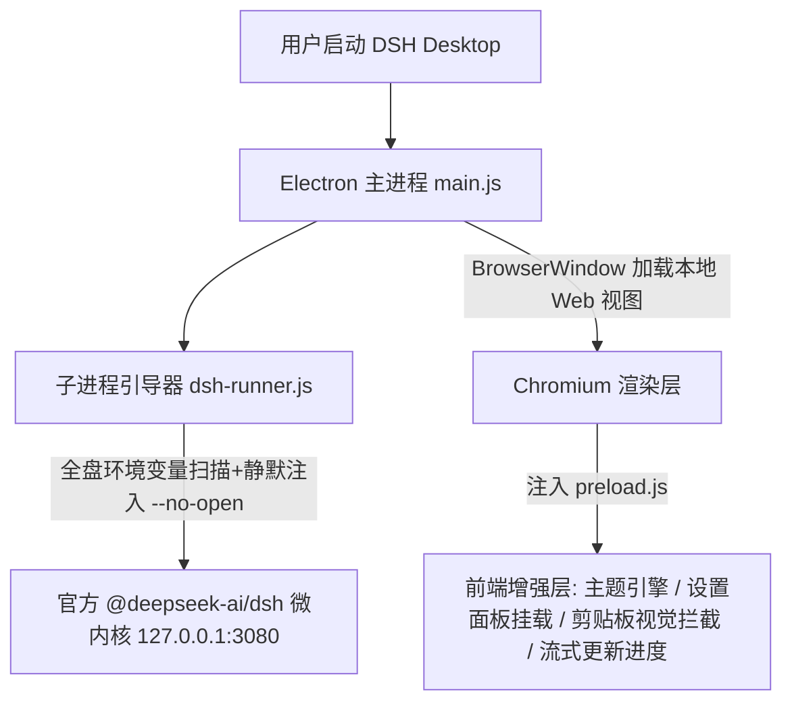

# 领域上下文地图 (Context Map)

## 1. 核心业务与领域模型

### 1.1 项目定位与核心价值
- **项目全称**：DeepSeek Harness Desktop (`dsh-desktop`)
- **核心定位**：基于 Electron 构建的 DeepSeek Harness 官方 Web GUI 现代化桌面客户端包装外壳。
- **业务价值**：
  - 将官方默认的命令行 + 浏览器标签页交互，升级为具备沉浸式窗口、系统托盘常驻、多模态剪贴板增强、无感后台终端执行、多款精雕专属美学主题体系与应用/内核一键热升级的工业级桌面体验。

### 1.2 核心架构分层与协作流

#### 核心组件职责：
1. **主进程 (`main.js`)**：
   - 负责 Electron 生命周期管理、单实例互斥锁 (`requestSingleInstanceLock`)、窗口控制与无边框拖拽。
   - 系统托盘 (`Tray`) 状态管理与上下文菜单（显示/隐藏、一键检查更新、内核热重启、退出）。
   - 全局异常捕获 (`uncaughtException`, `unhandledRejection`) 与错误弹窗兜底。
   - 错峰双更新系统（客户端安装包下载流式更新 + 官方微内核 npm 检查与热升级）。
   - IPC 消息中心：处理图片剪贴板持久化、版本查询、外部链接安全打开等。

2. **微内核运行器 (`dsh-runner.js`)**：
   - 智能扫描 Windows PATH、多版本管理器（NVM / FNM / Volta / Scoop）与全局/局部 node_modules。
   - 静默启动 DSH 微内核，强制追加 `--no-open` 与 `windowsHide: true`，消除 CMD 黑色控制台弹窗与浏览器自动弹出。

3. **渲染注入层 (`preload.js`)**：
   - **4 套专属精雕主题与 8 款配色矩阵**：100% 对齐 codex-desktop 与 VS Code 官方正统 `liulongbin1314.escook-theme` 调色哲学：`escook Dark`（经典暖调极客深灰 · 标志暖阳橙）、`escook Dark Soft`（Ayu 深海蓝灰 · 柔光奶杏黄）、`escook Light`（Solarized 护眼暖米白 · 典雅紫罗兰）、`escook Light Soft`（现代极简清透浅灰 · 活力柔和橙）及官方深浅色适配，通过全局 CSS 变量体系无损即时热换肤。
   - **设置面板扩展**：在官方设置侧边栏动态挂载【🎨 主题外观】与【ℹ️ 关于 DSH Desktop】Tab 面板。
   - **多模态与输入增强**：输入框拦截 Ctrl+V 剪贴板截图或图片拖拽，自动调用主进程保存为本地临时文件并回填路径（消除“不支持附件”报错）。
   - **向后兼容垫片**：为新内核注入 `settingsNamespace` 与 `effectivePermissionPreset` 兼容垫片，确保市场 5 大社区插件稳定运行。

4. **内置生态与技能 (`bundled-skills/`, `plugins/`)**：
   - 首次启动自动释放内置 35 项 Matt Pocock 专家研发技能至用户目录（`~/.deepseek/harness/skills` 或 `~/.dsh/skills`）。
   - 内置并发布标准主题插件 `dsh-theme-escook`。

---

## 2. 关键 API 与环境约定

### 2.1 开发与构建命令
| 命令 | 描述 | 产物与行为 |
| :--- | :--- | :--- |
| `npm start` | 启动开发模式 | 启动 Electron 并拉起本地内核 |
| `npm run build:icon` | 重新生成多尺寸应用图标 | 基于 `build/icon-source.svg` 生成 `icon.ico` 与 `icon.png` |
| `npm run dist` | 构建 Windows 安装包 | 执行 `electron-builder --win` 生成 NSIS 安装程序 (`release/*.exe`) |
| `npm run release` | 当前版本全自动打包分发 | 自动校验、打包、保留最新 2 个版本产物并生成更新摘要 |
| `npm run release:patch` / `minor` / `major` | 自动版本递增并打包 | 升级 `package.json` 版本号并执行打包分发流程 |

### 2.2 本地通信与网络约束
- **核心 Web 服务端口**：`http://127.0.0.1:3080`（支持环回本地免密鉴权放行规则）。
- **更新检查网络通道**：
  - 客户端更新：探测 GitHub Releases 重定向与网页直达，自动规避 GitHub API 匿名 403 限流；
  - 内核升级：通过 `registry.npmmirror.com` 或 `registry.npmjs.org` 探测 `@deepseek-ai/dsh` 最新版本。

### 2.3 关键 IPC 通道清单
| 通道名称 | 类型 | 业务参数 | 返回值 / 作用 |
| :--- | :--- | :--- | :--- |
| `save-paste-image` | `handle` | `{ buffer: Uint8Array, ext: string }` | 返回本地生成的安全临时图片绝对路径 |
| `app-version` | `handle` | 无 | 返回客户端版本与当前 DSH 内核版本 |
| `check-update` | `handle` | 无 | 触发应用外壳新版本检查 |
| `start-download-update`| `handle` | `{ assetUrl, newVersion }` | 启动应用内流式下载并自动唤起安装器 |
| `check-kernel-update` | `handle` | 无 | 检查官方 npm 内核最新版本 |
| `upgrade-kernel` | `handle` | 无 | 静默执行 `npm i -g @deepseek-ai/dsh@latest` 并热重启服务 |
| `restart-app` | `handle` | 无 | 软重启 Electron 应用与后台微内核 |

---

## 3. 架构约束与排坑红线 (Guardrails & Gotchas)

1. **绝对禁止自动 Git Push**：
   - 遵循 `AGENTS.md` 顶层规则，任何脚本或代码在未获得用户显式指令前严禁向远程仓库推送。
2. **内核启动参数保护**：
   - 严禁移除 `dsh-runner.js` 中拉起微内核时的 `--no-open` 与 `windowsHide: true` 参数，否则会导致多余浏览器窗口弹出或 CMD 黑框闪烁。
3. **DOM 注入与样式覆盖幂等性**：
   - `preload.js` 中的 DOM 挂载逻辑必须具备防重复执行机制（如检查特定 ID / attribute 是否已存在），避免页面热刷新或 Tab 切换时产生重复 DOM 节点。
4. **主题变量统一性**：
   - 新增或调整主题样式时，必须统一对接 `--dsw-*` CSS 变量系统与主题类选择器，严禁使用硬编码内联样式破坏深浅色适配。
